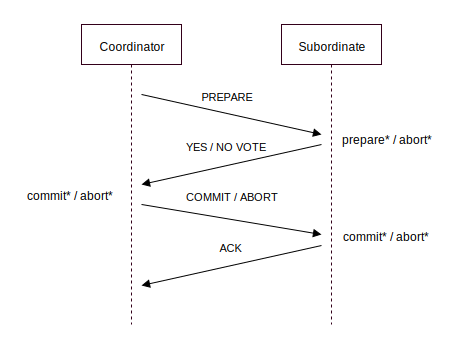
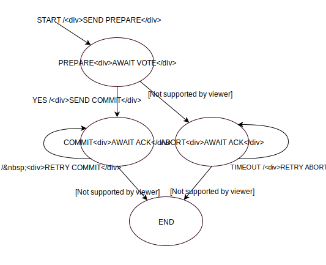
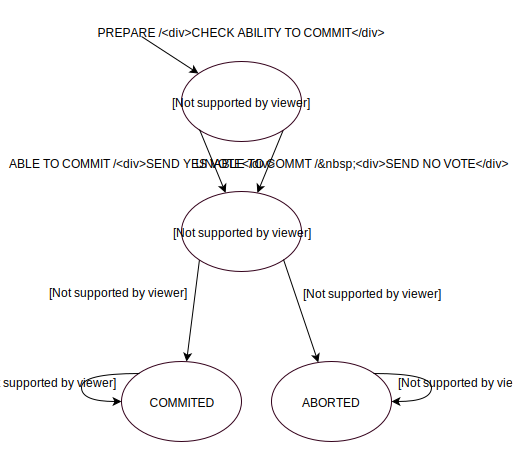

## Two Phase Commit
### by [Rafael Kallis](http://rafaelkallis.com), [Elias Bernhaut](https://github.com/alpox)

___

## Problem Definition

Unlike a transaction on a local database, a distributed transaction involves altering data on multiple databases. Consequently, distributed transaction processing is more complicated, because the database must coordinate the committing or aborting the changes in a transaction as a self-contained unit. In other words, the entire transaction commits, or the entire transaction aborts.

---

## Two Phase Commit Protocol

The database ensures the integrity of data in a distributed transaction using the two-phase commit mechanism. In the prepare phase, the coordinator in the transaction asks the subordinates to promise to commit or abort the transaction. If all subordinates are able to commit the transaction, the transaction stages in the commit phase, otherwise it stages in the abort phase. During the commit phase, the coordinator asks all subordinates to commit the transaction. During the abort phase, all subordinates are asked to abort. You can view an illustration of the protocol below.

### Protocol Diagram

##### An * next to the record type means that the record is forced to stable storage.

We assume that each tranaction runs through a different instance of the state charts below. When the transaction starts, the coordinator sends *prepare* messages to all subordinates. The coordinator awaits all subordinates to respond with their votes. If all subordinates responded with a *yes* vote the coordinator sends *commit* messages to all subordinates. If any subordinate responded to the *prepare* message with a *no* or a timeout has occured, the coordinator sends *abort* messages to all subordinates. After sending *commit* (*abort*) messages, the coordinator awaits all subordinates to respond with an *ack* message. If a timeout occurres while waiting, the coordinator retransmitts the *commit* (*abort*) message to the respective subordinate. The transaction ends when all subordinates have responded with an *ack* message to the coordinator's *commit* (*abort*) message.

### Coordinator State Chart

### Subordinate State Chart

### Formalisation of the Problem

Let *N* = { 0, 1, ... , n } denote the set of all nodes, which includes the coordinator and all subordinates.

Let n0 &isin; *N* denote the coordinator.

Let ni &isin; *N*, i &ne; 0 denote all subordinates.

Let *T* = { 0, ... , m } denote the set of all transactions 

Let t &isin; T denote a transaction.

Let *S* = { Commit, Abort } denote the set of possible states. Note that the states used here are *independent* from the states used in the state charts above.

Let *&fnof;* : *N* x *T* &rarr; *S* denote the function which maps to a state, given a node and a transaction.

In order to reach a consistent state, following condition must be satisfied:

&fnof;( ni, t ) = &fnof;( nj, t )

## Proof

---

### (Theorem 1) &fnof;(ni, t) = Commit &rArr; &fnof;(n0, t) = Commit, i &ne; 0
#### (If a subordinate is in commit state, the coordinator must also be in commit state)

*Proof:* In order for subordinate ni to be in commit state,
the coordinator n0 must have entered the commit state before ni and then sent a commit message to ni. It is impossible for the coordinator to send a commit message, if he is not in the commit state.

---

### (Theorem 2) &fnof;(ni, t) = Abort &rArr; &fnof;(n0, t) = Abort, i &ne; 0
#### (If a subordinate is in abort state, the coordinator must also be in abort state)

*Proof:* (Analogus to 1) In order for subordinate ni to be in abort state,
the coordinator n0 must have entered the abort state before n1 and then sent an abort message to n1. It is impossible for the coordinator to send an abort message, if he is not in the abort state.

---

### (Theorem 3) &fnof;(n0, t) = Commit &rArr; &fnof;(ni, t) = Commit, i &ne; 0

#### (If the coordinator is in commit state, all subordinates must also be in commit state)

*Proof:* If the coordinator n0 enters commit state, he must send commit messages to all subordinates ni. All subordinates must respond to the commit message with an ack message. If the coordinator doesn't receive an ack message from a subordinate after a fixed timeout, the coordinator retransmitts the commit message. Eventually all subordinates will receive the commit message, thus every subordinate ni must be in commit state. It is impossible for the coordinator to send any other message than the commit message in the commit phase.

---

### (Theorem 4) &fnof;(n0, t) = Abort &rArr; &fnof;(ni, t) = Abort, i &ne; 0

#### (If the coordinator is in abort state, all subordinates must also be in abort state)

*Proof:* If the coordinator n0 enters abort state, he must send abort messages to all subordinates ni. All subordinates must respond to the abort message with an ack message. If the coordinator doesn't receive an ack message from a subordinate after a fixed timeout, the coordinator retransmitts the abort message. Eventually all subordinates will receive the abort message, thus every subordinate ni must be in abort state. It is impossible for the coordinator to send any other message than the abort message in the abort phase.

---

### (Theorem 5) &fnof;(ni, t) = Commit &hArr; &fnof;(nj, t) = Commit

#### (If one node is in commit state, then all other nodes must also be in commit state)

*Proof:* We consider 3 possible cases:

*Case 1:* i &ne; j = 0 (ni is subordinate, nj is coordinator)

As shown in (3), if &fnof;(nj, t) = Commit &rArr; &fnof;(ni, t), and as shown in (1) if &fnof;(ni, t) = Commit &rArr; &fnof;(nj, t), thus follows that &fnof;(ni, t) = Commit &hArr; &fnof;(nj, t) = Commit, for i &ne; j = 0.

*Case 2:* j &ne; i = 0 (ni is coordinator, nj is subordinate)

As shown in (3), if &fnof;(ni, t) = Commit &rArr; &fnof;(nj, t), and as shown in (1) if &fnof;(nj, t) = Commit &rArr; &fnof;(ni, t), thus follows that &fnof;(nj, t) = Commit &hArr; &fnof;(ni, t) = Commit, for j &ne; i = 0.

*Case 3:* i = j &ne; 0 (both ni and nj are subordinates)

As shown in (3), if &fnof;(ni, t) = Commit &rArr; &fnof;(n0, t), and as shown in (1) if &fnof;(n0, t) = Commit &rArr; &fnof;(nj, t). Intuitively this meens that if subordinate ni is in commit state, the coordinator also must be in commit state and thus subordinate j also must be in commit state. Thus follows that &fnof;(nj, t) = Commit &hArr; &fnof;(ni, t) = Commit, for i = j &ne; 0.

From cases 1,2,3 follows that &fnof;(ni, t) = Commit &hArr; &fnof;(nj, t) = Commit. Simply put, it means that if a node is in commit state, any other node also must be in commit state for transaction t.

---

### (Theorem 6) &fnof;(ni, t) = Abort &hArr; &fnof;(nj, t) = Abort

#### (If one node is in abort state, then all other nodes must also be in abort state)

*Proof:* (Analogus to 5) We consider 3 possible cases:

*Case 1:* i &ne; j = 0 (ni is subordinate, nj is coordinator)

As shown in (3), if &fnof;(nj, t) = Abort &rArr; &fnof;(ni, t), and as shown in (1) if &fnof;(ni, t) = Abort &rArr; &fnof;(nj, t), thus follows that &fnof;(ni, t) = Abort &hArr; &fnof;(nj, t) = Abort, for i &ne; j = 0.

*Case 2:* j &ne; i = 0 (ni is coordinator, nj is subordinate)

As shown in (3), if &fnof;(ni, t) = Abort &rArr; &fnof;(nj, t), and as shown in (1) if &fnof;(nj, t) = Abort &rArr; &fnof;(ni, t), thus follows that &fnof;(nj, t) = Abort &hArr; &fnof;(ni, t) = Abort, for j &ne; i = 0.

*Case 3:* i = j &ne; 0 (both ni and nj are subordinates)

As shown in (3), if &fnof;(ni, t) = Abort &rArr; &fnof;(n0, t), and as shown in (1) if &fnof;(n0, t) = Abort &rArr; &fnof;(nj, t). Intuitively this meens that if subordinate i is in abort state, the coordinator also must be in abort state and thus subordinate j also must be in abort state. Thus follows that &fnof;(nj, t) = Abort &hArr; &fnof;(ni, t) = Abort, for i = j &ne; 0.

From cases 1,2,3 follows that &fnof;(ni, t) = Abort &hArr; &fnof;(nj, t) = Abort. Simply put, it means that if a node is in abort state, any other node also must be in abort state for transaction t.

---

### (Theorem 7) &fnof;( ni, t ) = &fnof;( nj, t )

#### (all nodes have the same state, consistent state)

*Proof:* As shown in (5) and (6), if any node is in commit (abort) state, then any other node must be in commit (abort) state. Thus follows:

### &fnof;( ni, t ) = &fnof;( nj, t )

*Proof Complete.* 